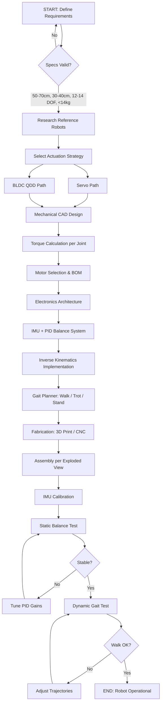

# خوارزمية البناء — Algorithm Deep Dive

> Task 5 · Part 1 — Smart Methods Mechanics · 2026

---

## 1. Master Algorithm Flowchart



---

## 2. Phase Details

### Phase 1 — Requirements Matrix

| Parameter | Min | Target | Max | Unit |
|-----------|-----|--------|-----|------|
| Body Length | 50 | 60 | 70 | cm |
| Body Height | 30 | 35 | 40 | cm |
| Total DOF | 12 | 12 | 14 | — |
| Total Mass | — | 12 | 14 | kg |
| Leg Segments | 2 | 3 | 3 | per leg |

### Phase 2 — Torque Sizing Formula

```
For each joint:

  τ_static = (m_robot × g × L_segment) / n_supporting_legs

  τ_dynamic = τ_static × SF

  SF = 2.0  (walking)
  SF = 3.0  (running/jumping)

Example (14 kg robot, 25 cm segment, 2 legs in trot):
  τ = (14 × 9.81 × 0.25) / 2 = 17.17 N·m ≈ 175 kg·cm
  τ_dynamic = 175 × 2 = 350 kg·cm (knee joint)
```

### Phase 3 — Control Loop Architecture

```
┌─────────────────────────────────────────────────────────┐
│                    MAIN CONTROL LOOP                     │
│                      (100 Hz)                            │
├─────────────────────────────────────────────────────────┤
│                                                          │
│  1. READ sensors:                                        │
│     - IMU → roll, pitch, yaw                            │
│     - Encoders → joint angles (if available)            │
│                                                          │
│  2. COMPUTE desired body pose:                           │
│     - From gait planner OR user command                 │
│                                                          │
│  3. BALANCE correction:                                  │
│     - PID(roll_error)  → Δfoot_y for each leg           │
│     - PID(pitch_error) → Δfoot_x for each leg           │
│                                                          │
│  4. INVERSE KINEMATICS:                                  │
│     - foot_positions[4] → joint_angles[12]              │
│                                                          │
│  5. SEND motor commands:                                 │
│     - PWM / CAN → 12 actuators                          │
│                                                          │
│  6. LOG data (optional)                                  │
│                                                          │
└─────────────────────────────────────────────────────────┘
```

### Phase 4 — Gait State Machine

```
States:
  IDLE → STAND → WALK → TROT → SIT → IDLE

TROT cycle (4 phases, 50ms each):
  Phase 0: Swing FL, RR | Stance FR, RL
  Phase 1: Transition body weight
  Phase 2: Swing FR, RL | Stance FL, RR
  Phase 3: Transition body weight
  → Loop to Phase 0

Foot trajectory (swing phase):
  x(t) = x_start + (x_end - x_start) × t/T
  z(t) = z_ground + h_swing × sin(π × t/T)
  where h_swing = 3-5 cm
```

### Phase 5 — IK Pseudocode

```python
def inverse_kinematics(foot_x, foot_y, foot_z, L1, L2, L3):
    """
    3-DOF leg IK — geometric closed-form solution
    L1 = hip link, L2 = femur, L3 = tibia
    Returns: (theta_haa, theta_hfe, theta_kfe) in radians
    """
    import math

    # Hip Abduction
    r_yz = math.sqrt(foot_y**2 + foot_z**2)
    theta_haa = math.atan2(foot_y, math.sqrt(foot_x**2 + foot_z**2))

    # Project to sagittal plane
    d = math.sqrt(foot_x**2 + foot_y**2 + foot_z**2)
    d = max(min(d, L2 + L3 - 0.001), abs(L2 - L3) + 0.001)

    # Knee angle (cosine law)
    cos_knee = (L2**2 + L3**2 - d**2) / (2 * L2 * L3)
    theta_kfe = math.acos(cos_knee) - math.pi

    # Hip pitch
    cos_alpha = (L2**2 + d**2 - L3**2) / (2 * L2 * d)
    alpha = math.acos(cos_alpha)
    beta = math.atan2(foot_z, foot_x)
    theta_hfe = alpha + beta

    return theta_haa, theta_hfe, theta_kfe
```

### Phase 6 — Balance PID

```python
class BalanceController:
    def __init__(self):
        self.kp_roll, self.ki_roll, self.kd_roll = 0.5, 0.01, 0.05
        self.kp_pitch, self.ki_pitch, self.kd_pitch = 0.5, 0.01, 0.05
        self.integral_roll = 0.0
        self.integral_pitch = 0.0
        self.prev_roll = 0.0
        self.prev_pitch = 0.0

    def update(self, roll, pitch, dt):
        # Roll correction
        err_r = 0.0 - roll
        self.integral_roll += err_r * dt
        d_roll = (roll - self.prev_roll) / dt
        corr_roll = (self.kp_roll * err_r +
                     self.ki_roll * self.integral_roll +
                     self.kd_roll * d_roll)

        # Pitch correction
        err_p = 0.0 - pitch
        self.integral_pitch += err_p * dt
        d_pitch = (pitch - self.prev_pitch) / dt
        corr_pitch = (self.kp_pitch * err_p +
                      self.ki_pitch * self.integral_pitch +
                      self.kd_pitch * d_pitch)

        self.prev_roll = roll
        self.prev_pitch = pitch

        return corr_roll, corr_pitch
```

---

## 3. Decision Tree — Actuator Selection

```
Robot mass > 10 kg?
├── YES → BLDC QDD (TMotor + ODrive) or Dynamixel XM/XC series
│         Torque required > 20 kg·cm per joint
└── NO  → Digital servos (DS3225) or Dynamixel AX/MX series
          Torque required 8-20 kg·cm per joint

Need position feedback?
├── YES → Dynamixel (closed-loop) or BLDC + encoder
└── NO  → Standard PWM servo (open-loop)

Budget constraint?
├── LOW  → DS3225 × 12 (~$180 total)
├── MID  → Dynamixel XM430 × 12 (~$3,360 total)
└── HIGH → Custom BLDC actuators (MIT Cheetah style)
```

---

## 4. Validation Checklist

| Test | Pass Criteria | Phase |
|------|---------------|-------|
| Motor direction | All 12 move correctly | Assembly |
| IMU calibration | Roll/Pitch < 1° when level | Calibration |
| Static stand | 4 legs, body level 5 sec | Balance |
| 3-leg stand | Stable when 1 leg lifted | Balance |
| Slow walk | 4 steps without fall | Gait |
| Trot | Continuous 10 steps | Gait |
| Weight check | Total < 14 kg | Final |

---

[← Back to README](../README.md) · [Sources →](SOURCES.md)
